# Machine Learning Engineer Nanodegree
## Capstone Project
Thiago Junqueira Vilarinho
May 22th, 2018

## I. Definition

### Project Overview

Since taxi companies use vehicle's allocated time and trip distance to charge the passenger's trip, be able to predict the price of trip based on this information helps in the audit process, estimates of the company's profit or even charge the passenger before the trip, like Uber.

With information of every trip about when and where the passenger were picked up and droped off and how many passengers triped will allow the company to estimate how many time vehicle will be allocated and, based on that information, how much passenger should pay.

This project is based on 2016 NYC Yellow Cab trip record data and relates to the problem because it has the trip distance, trip duration and number of passengers. Since we are trying to estimate travel time on New York City, this is an appropriate dataset for the problem.

This dataset was obtained on Kaggle Competition New York City Taxi Trip Duration (https://www.kaggle.com/c/nyc-taxi-trip-duration) and is splitted on train and test datasets. Train dataset contains 1.458.644 trip records.

The proposed solution is to, based on some input variables, train a neural network with backpropagation to define weights on each perceptron to output the estimate trip duration. After, will be used Test Dataset to evaluate performance of this neural network on estimate trip duration using Root Mean Squared Logarithmic Error as evaluate metric.

Another approaches to solving the same problem was created for the same Kaggle competion (https://www.kaggle.com/c/nyc-taxi-trip-duration/leaderboard). Another submission for a similiar problem from September 2015 is available on Cornell University Library (https://arxiv.org/abs/1509.05257)

### Problem Statement

The problem to be solved is based on distance between pick up and drop off points, pick up time and the number of passengers, estimate travel time using neural network.

The expected output value is a continuous value, the estimated trip duration, insted of a discrete value, this way makes sense using a regression neural networks instead of a classification one.

The proposal is to define weigths to calculate ETT as:  
ETT = W1 * D + W2 * T + W3 * P

Where:  
D is th distance between pick up and drop off points  
T is the pick up time  
P is the number of passengers  

### Metrics

The evaluation metric to this solution is Root Mean Squared Logarithmic Error, calculated as:  
E=sqrt(1 / n * ∑ (log(pi + 1) − log(ai + 1))²)

Where:  
E is the RMSLE value (score)  
n is the total number of observations in the (public/private) data set  
pi is your prediction of trip duration  
ai is the actual trip duration for i  
log(x) is the natural logarithm of x  

This metric was chosen for the competition, so it was used the same metric on this project.

This metric is used to measure differences between predicted value and actual value as prediction error and serves to aggregate the magnitudes of the error in predictions for various times into single measure of predictive power. Since it is a accuracy metric, it is used to compare errors of different models for the same dataset. Also, this metric has the ability to penalize under estimates more than over estimates.

## II. Analysis

### Data Exploration

This project is based on 2016 NYC Yellow Cab trip record data and relates to the problem because it has the trip distance, trip duration and number of passengers. Since we are trying to estimate travel time on New York City, this is an appropriate dataset for the problem.

This dataset was obtained on Kaggle Competition New York City Taxi Trip Duration (https://www.kaggle.com/c/nyc-taxi-trip-duration) and is splitted on train and test datasets. Train dataset contains 1.458.644 trip records and Test dataset contains 625.134 trip records.

This dataset is composed by the following data fields:  
- id: an unique identifier for each trip  
- vendor_id: a code indicating the provider associated with the trip record  
- pickup_datetime: date and time when the meter was engaged  
- dropoff_datetime: date and time when the meter was disengaged  
- passenger_count: the number of passengers in the vehicle (driver entered value)  
- pickup_longitude: the longitude where the meter was engaged  
- pickup_latitude: the latitude where the meter was engaged - dropoff_longitude: the longitude where the meter was disengaged  
- dropoff_latitude: the latitude where the meter was disengaged  
- store_and_fwd_flag: This flag indicates whether the trip record was held in vehicle memory before sending to the vendor because the vehicle did not have a connection to the server: Y=store and forward; N=not a store and forward trip  - trip_duration: duration of the trip in seconds  

This dataset will be used to train neural network with backpropagation to define weights on each perceptron to output the estimate trip duration. After, will be used Test Dataset to evaluate performance of this neural network on estimate trip duration using Root Mean Squared Logarithmic Error as evaluate metric.

Rows of dataset with _trip_duration_ value below -0.1388 (Q1 - 1.5 * IQR) and above 0.5135 (Q3 + 1.5 * IQR) will be considered as outliers and dropped from dataset.

IQR is a measure of statistical dispersion meaning Interquatile Range. Each quartile is based on feature median value (50%) and Q1 is 25% of this median value and Q3 is 75% of feature median value. IQR, is the difference between Q3 and Q1 and, in this case, has value of 0.1631.

### Exploratory Visualization

A relevant feature about the data is shown in *Figure 1* that relates distance by the mean time travel (in hours).

While short trips, less than 3 km, the mean time travel increases, on average, 36% for longer trips, longer than 3 km, the mean time travel increases, also on average, 16%.

| 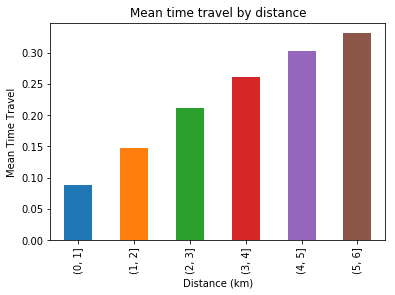 | 
|:--:| 
| *Figure 1* |

This is a quite obvious considering distance by time, but it is interesting to note that the longer the trip, the additional travel time does not increase in the same proportion as short trips.

### Algorithms and Techniques

The solution to the problem is using MLPRegressor that implements a multi-layer perceptron that trains using backpropagation without activation function on the output layer. This neural network should be trained to output the estimate time travel (in hours) based on input set as: pick up and drop off location, pick up time and number of passengers.

This regressor will use Adam Stochastic Gradient-Based optimizer as loss function to update weights and Root Mean Squared Logarithmic Error as evaluate metric.

A regressor algorithm was chosen because the expected output is a continuous value, the estimated travel time, in hours, based on input features. If the expected output were a discrete value, which categorized the input values in some group, we could choose MLPClassifier.

### Benchmark

The benchmark model that relates to the problem statement is the kernel published by Danijel Kivaranovic for the same Competition (https://www.kaggle.com/danijelk/beat-the-benchmark), where the score reached was 0.39016 in the same metric (Root Mean Squared Logarithmic Error).

The benchmark solution uses XGBoost as regressor, that implements gradient boosting algorithm.

XGBoost provides a parallel tree boosting (also known as GBDT, GBM) that solve many data science problems in a fast and accurate way. 

## III. Methodology

### Data Preprocessing

The algorithm chosen, Multi-Layer Perceptron Regressor, does not required any preprocessing step on input data.

However, dataset was manipulated to be used by the estimator as proposed, as follow:

- Columns _id_, _vendor_id_, _dropoff_datetime_ and _store_and_fwd_flag_ was dropped because it is irrelevant to the problem
- _pickup_datetime_ was transformed to datetime value and the hour extracted to a new column _pickup_hour_ and the original column dropped from the dataset
- _passenger_count_ was transformed to an integer number value
- _pickup_longitude_, _pickup_latitude_, _dropoff_longitude_ and _dropoff_latitude_ was transformed to a new column _distance_, using *geopy* library, and then dropped
- _trip_duration_ was transformed from seconds to hours and splitted from the input dataset to be used in train and evaluation process as output value

The Geopy library was used to calculate distance between pickup and dropoff coordinates. This library uses the *geodesic* algorithm given by [Karney (2013)](https://link.springer.com/article/10.1007%2Fs00190-012-0578-z).  This algorithm calculates the shortest distance on the surface of an ellipsoidal model of the Earth.

### Implementation

The process to calculate the score for the estimated output has to be implemented, since any implementation was found on sklearn library documentation.

The method to implement Root Mean Squared Logarithmic Error was iterate through both arrays (real and predicted) calculating the sum of squared diference between the log of each value.

To calculate distance between the 2 coordinates using geopy library, new columns has to be added to the original dataset including an array with 2 values for each row, latitude and longitude. This way was possible to calculate the *distance* value for each row using *distance* function of *geopy.distance* module and getting the *km* property.

To extract the pickup hour from *pickup_datetime* column, was used Pandas *to_datetime* function to convert the original value to a datetime value. To get the hour part, the *hour* property from datetime datatype was used.

The process to remove outliers used the Pandas *quantile* function to get Q1 and Q3 values. So it was possible to calculate IQR and select the rows that was inside the allowed range.

To remove duplicates from dataset was used the Pandas *drop_duplicates* that returns a DataFrame with duplicate rows removed. For this process was considered all columns in dataset.

As the objective was to get the score for a test dataset, the original dataset was splitted between train and test dataset using *train_test_split* from *sklearn.model_selection* module. In this step, the origintal dataset was splitted into a test dataset with 20% of the original size.

The MLPRegressor created uses only the default parameters, except for *random_state* that was set to a value of 300.

The score achived was the best calculated with this regressor. The following parameters was tried but any improvement on score was achived:

- activation
- alpha
- batch_size
- learning_rate
- shuffle
- beta_1
- beta_2
- epsilon

The best improvement on score was made changing the input travel time from seconds to hour.

Even with this good score achived by this solution, it was not better than the benchmark solution and a better solution was not found with the proposal solution.

### Refinement

The initial solution, using seconds in *trip_duration* and *random_state* with value 3, achived a score of 0.5284. This was not considered a good solution, since the optimal score is near 0.00.

Then, a new attempt was made using minutes rather than hours for this value. The score achived was 0.4604.

The last attempt tunning *trip_duration* was converting the original value to hours. The score achived was 0.1437.

With the score achived using *trip_duration* in hours, a new tunning was tried mixing the MLPRegressor parameters as follow:

| activation | learning_rate | score |
| --- | --- | --- | --- |
| identity | constant | 0.0659 |
| logistic | constant | 0.0608 |
| tanh | constant | 0.0637 |
| relu | constant | 0.0618 |
| identity | invscaling | 0.0659 |
| logistic | invscaling | 0.0608 |
| tanh | invscaling | 0.0637 |
| relu | invscaling | 0.0618 |
| identity | adaptive | 0.0659 |
| logistic | adaptive | 0.0608 |
| tanh | adaptive | 0.0637 |
| relu | adaptive | 0.0618 |
Table: Tunning MLPRegressor

The final solution, as shown, set the *random_seed* to *300* and *activation* to *logistic* as the better score, for this input dataset and expected output.

## IV. Results

### Model Evaluation and Validation

The final model is aligned with solution expectation and final parameters are appropriate, like demonstrated in table *Tunning MLPRegressor*.

The model was tested with test dataset and generalized well to unseen data, the output was related with expectations from the trained dataset.

Considering that on train dataset has 1275828 entries and on test dataset has 1458644 entries, the mean *trip_duration* on train dataset is 1.86 and on test dataset is 2.08. 

Model is robust, small changes on data does not affect results in an unexpected way as we can see on following graphics that follow the same pattern on train dataset and test dataset:

| 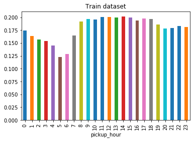 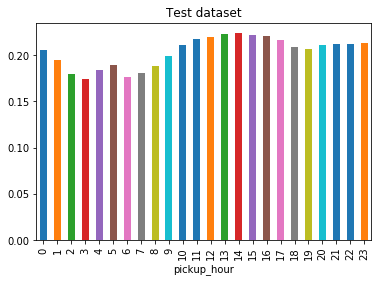 |
|:--:| 
| *Duration by pickup hour* |

| 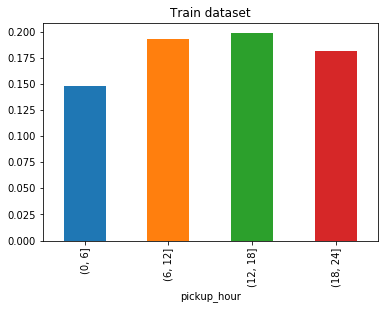 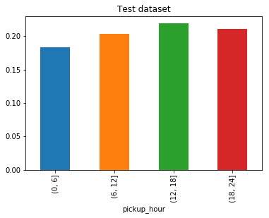 | 
|:--:| 
| *Duration by pickup range* |

| 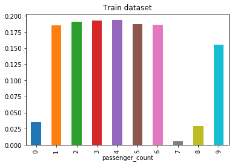 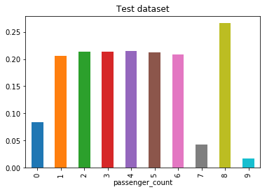 | 
|:--:| 
| *Duration by passenger count* |

|  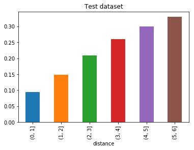 | 
|:--:| 
| *Duration by distance* |

By this demonstration, we can see that this model can be trusted. The only data that should be improved is *trip_duration* by *passenger_count* when number of passengers is 8 or 9.

### Justification

Final solution of this project reached 96% of benchmark score, so benchmark model, using XGBoost fitted better than MLPRegressor to the train dataset.

Despite the fact of the score reached being lower than benchmark, final solution solved the problem, and it can work better than benchmark model since MLPRegressor has partial fit, that can improve model without need to fit all dataset again. With this feature, model can be improved with every single new input, and in the long term can score better than benchmark model.

Considering the mean *trip_duration* on benchmark model is 2.10, which means that final model performed better than benchmark model to unseen data, since mean trip_duration on final model is 2.08.

But considering the graphics below, we can see that benchmark model generalizes better than the final model, since it perform well on all charactericts.

|  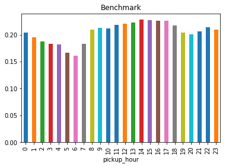 |
|:--:| 
| *Duration by pickup hour* |

|  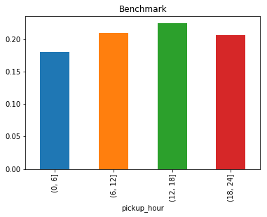 | 
|:--:| 
| *Duration by pickup range* |

|  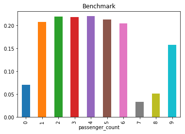 | 
|:--:| 
| *Duration by passenger count* |

|  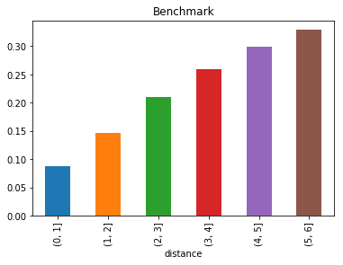 | 
|:--:| 
| *Duration by distance* |

## V. Conclusion

### Free-Form Visualization

I have found interesting to see that number and duration of trips is bigger in the afternoon and the morning than in the other periods, like shown in the graphics below.

|  | 
|:--:| 
| *Duration by pickup range* |

| 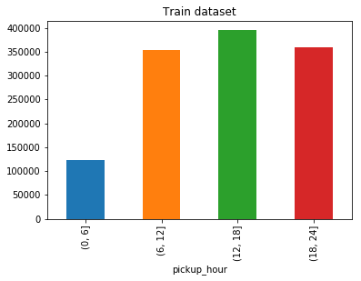 | 
|:--:| 
| *Trips by pickup range* |

It is important to notice that in this period of day, the taxi company could need to increase the number of cars to supply the demand of taxi in NYC.

This increase in number and duration of trips in the morning and afternoon could be motivated by people moving because of work. And trips at night could be motivated by people that leave work late or moving to some entertainment, like restaurants.

### Reflection
The problem solution is to clean and prepare input dataset to be fitted by the MLPRegressor using just some features of original dataset. Features used to predit the output value, estimated time travel in seconds, was the hour passenger was picked up, number of passengers and the trip distance in km.

To estimate the output was used a model based on neural network regressor, since the output is a continuous value, and not a discrete one, that should be used to classify the input data.

To train the model, the train dataset was splitted into 2 subsets. First subset, with 80% of original dataset was used to train the model and the other 20% of original dataset was used to test the trainned model.

This test subset also was used to validate benchmark model score.

An interesting point of the project was the score evolution when using trip_duration in hours, minutes and seconds. This gives the opportunity to evaluate that this model fit better with small values (between 0 and 1) than bigger values.

A difficult point was to calculate trip_distance using *geopy library*, since this library doesn't perform very well with larger datasets been processed as batch process.

Final model doesn't fit my initial expectations about neural networks been better than benchmark model, but, I'm satisfied that could reachead almost the same score. And the fact that this model can be partial fitted and improved in time with every single new input, makes me satisfied with this final solution.

### Improvement
A point of improvement of this final solution is changing *geopy library* for a faster one or implementing *geodesic* algorithm and applying it to the dataset to calculate trip_distance value.

Another improvement could be on parameters of the MLPRegressor to improve it's score and, maybe, reaching a better score than the benchmark and final solution.

Using my final model as a new benchmark, I would try an ensemble model like Gradient Boosting Regressor or Random Forest Regressor. Since the actual benchmark is based on Gradient Boosting, this others ensemble model should perform as well.